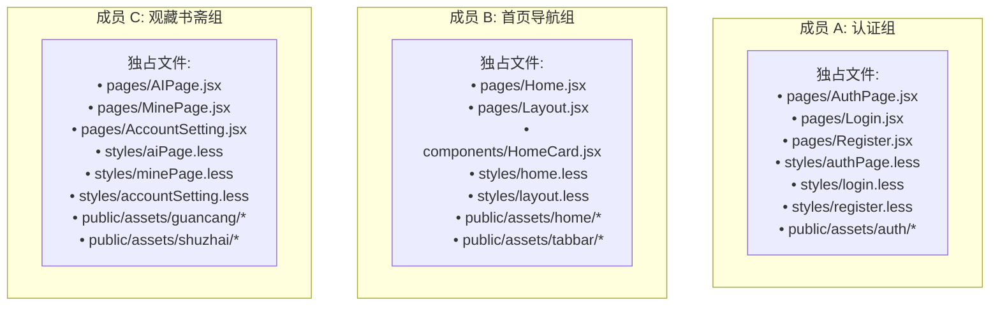

# 🏮《云山竹简 · 华风雅集》第一阶段协同开发与交接指南 (PHASE1_TASK_GUIDE.md)

> **致全体研发伙伴**：  
> 本项目为国风文化与 AI 雅聚平台《云山竹简 · 华风雅集》移动端全栈工程。  
> 本指南为**第一阶段（UI 与框架重构）的唯一执行基准**，请大家严格遵循各自的**代码物理隔离边界**与**每日交接规约**，确保 3 人并行协作 **0 冲突、高效率交付**。

---

## ⏱️ 一、 核心工期红线（倒排计划）

* **项目全周期目标**：**10 天内必须全部完工并完成云服务器上线部署**。
* **第一阶段交付红线**：**严格卡死 3 天（最晚第 3 天傍晚 18:00 前完成 PR 合并与封版）**。
* **阶段验收标志**：五大核心国风界面高保真还原、路由与基建贯通、多屏移动端视口走查通过。

---

## 🚀 二、 开工第一步：拉取最新基建与分支初始化

基建与样式变量已统一合入 `main`，**严禁在 `main` 直接开发**。请各成员在本地终端执行以下命令：

```bash
# 1. 切换到 main 并拉取最新基建代码
git checkout main
git pull origin main

# 2. 根据分工创建各自专属的特性分支
```

* **【成员 A】执行**：`git checkout -b feat/phase1-auth`
* **【成员 B】执行**：`git checkout -b feat/phase1-home`
* **【成员 C】执行**：`git checkout -b feat/phase1-literati`

---

## 👥 三、 任务分工与【严格文件白名单】（0 冲突铁律）

> ⚠️ **协同红线**：
> 1. 每个人**只能修改自身白名单内的文件**，严禁跨范围改动他人文件！
> 2. **全局冻结文件（严禁任何组员修改）**：`frontend/src/App.jsx`、`frontend/src/styles/global.css`、`frontend/src/styles/variables.less`。



---

### 👤 成员 A：身份认证与安全模块【入席 & 缔约】

* **设计稿参考**：`D:\图片\simo` 下的：
  * `2299d6017ffad90c7a252c0f296e2db2.png`（登录 · 落座入席）
  * `145631cdfb89b1a3f9b189a0a2dc36f5.png`（注册 · 完成缔约）
* **开发职责**：
  1. 宣纸卡片容器、印章【華風】Logo、滑动印符 Tab（入席/缔约）切换动画；
  2. 登录模块：账号、密押明暗文小眼睛、落座入席朱砂印章按钮、第三方登录、协议勾选；
  3. 注册模块：拟定雅号、手机号、水墨验真码即时刷新、设置密押、完成缔约按钮；
  4. 对接后端 `/api/auth/login`、`/api/auth/register`、`/api/auth/captcha`。
* **📁 独占可修改文件清单**：
  * `frontend/src/pages/AuthPage.jsx`
  * `frontend/src/pages/Login.jsx`
  * `frontend/src/pages/Register.jsx`
  * `frontend/src/styles/authPage.less`
  * `frontend/src/styles/login.less`
  * `frontend/src/styles/register.less`
  * 切图目录：`frontend/public/assets/auth/*`

---

### 👤 成员 B：主入口与公共导航域【雅集 & 底栏导航】

* **设计稿参考**：`D:\图片\simo` 下的：
  * `048335a5a594d0df4d079a8b659c407d.png`（首页 · 云山竹简）
* **开发职责**：
  1. 顶部大标「云山竹简」、副标「读千年风雅 与君共此山河」；
  2. 【每日诗签】展开式横向卷轴卡片（名句展示、印章戳记、诗名出处）；
  3. 岁时节气与干支物候信息栏（城市天气、农历干支日历、廿四节气卡片）；
  4. 四大核心雅席入口（2×2 宫格）：博古识器、先贤论道、飞花诗令、四般闲事；
  5. 重构公共底部导航：
     * 改造为三栏：【雅集】(`/home`)、【观藏】(`/ai`)、【书斋】(`/mine`)；
     * 古风器物图标适配与朱砂红激活态指示线。
* **📁 独占可修改文件清单**：
  * `frontend/src/pages/Home.jsx`
  * `frontend/src/pages/Layout.jsx`
  * `frontend/src/components/HomeCard.jsx`（或抽离专属子卡片）
  * `frontend/src/styles/home.less`
  * `frontend/src/styles/layout.less`
  * 切图目录：`frontend/public/assets/home/*`、`frontend/public/assets/tabbar/*`

---

### 👤 成员 C：知己观藏与墨隐书斋域【观藏 & 墨隐书斋】

* **设计稿参考**：`D:\图片\simo` 下的：
  * `28962a005c3325500d80073a57f7a4ac.png`（观藏 · 古风古友）
  * `e9cf705149a8608bc469e0ce422f22a3.png`（个人中心 · 墨隐书斋）
* **开发职责**：
  1. **观藏页**：
     * 顶部先贤横向画廊（李白、苏轼、王阳明、李清照等立绘与朱砂名牌）；
     * 三大功能卷轴卡：「古友论道」、「诗韵唱和」、「抚琴听音」及标签入口；
  2. **书斋页**：
     * 雅士身份卡：水墨头像框、雅号「云山居士」、称号勋标「翰林待诏」、个签；
     * 4 列修持数据看板：12 鉴宝藏器 ｜ 36 论道问策 ｜ 48 诗签摘录 ｜ 玖阶 文风品阶；
     * 双列表分组卡片：「藏品与墨卷」与「书斋清规」；
  3. 账号设置页适配（`AccountSetting.jsx`）与退出登录清除 Token。
* **📁 独占可修改文件清单**：
  * `frontend/src/pages/AIPage.jsx`
  * `frontend/src/pages/MinePage.jsx`
  * `frontend/src/pages/AccountSetting.jsx`
  * `frontend/src/styles/aiPage.less`
  * `frontend/src/styles/minePage.less`
  * `frontend/src/styles/accountSetting.less`
  * 切图目录：`frontend/public/assets/guancang/*`、`frontend/public/assets/shuzhai/*`

---

## 🎨 四、 样式规范与 Tokens 引用速查

所有页面 `.less` 文件顶部统一引入变量表，严禁在局部样式中直接写死十六进制色值：
```less
@import '../styles/variables.less';
```

| 变量名 | 色值 | 对应传统名称与用法 |
| :--- | :--- | :--- |
| `@color-bg` | `#F5F0E6` | **宣纸原色**：页面背景，生宣微黄质感 |
| `@color-card` | `#FAF7F0` | **绢帛玉白**：卡片底色，羊脂玉/素绢 |
| `@color-text-main` | `#22252A` | **远山黛墨**：正文、主标题浓墨 |
| `@color-text-sub` | `#5C6068` | **淡墨焦墨**：副标题、辅助时间戳 |
| `@color-seal` | `#9E2A2B` | **朱砂印泥红**：印章 Logo、CTA 按钮、激活高亮 |
| `@color-bamboo` | `#3A5A40` | **苍竹墨绿**：器物标签、点缀小标 |
| `@color-gold` | `#C59B27` | **沉香古金**：称号勋章、卷轴金属包边 |
| `@color-border` | `#E2D9C8` | **古纸线界**：浅淡纸张折痕与分隔线 |
| `@radius-card` | `10px` | 卡片规范圆角（8px~12px 方正典雅，忌用卡通大圆角） |

---

## 📝 五、 每日工作交接文档规范（必填制度）

为保障开发透明度、方便技术组长 Code Review 与阶段验收，**每位成员每天下班前或每次提 PR 前，必须在独立交接文档中填写当天记录，并随代码一同提交到各自 Git 分支**。

### 1. 文件存放路径（每个人独立文件，绝无冲突）：
* **成员 A 填写**：`docs/handovers/dev-A-auth.md`
* **成员 B 填写**：`docs/handovers/dev-B-home.md`
* **成员 C 填写**：`docs/handovers/dev-C-literati.md`

### 2. 交接记录填写模板（直接复制）：
```markdown
# 📅 开发交接记录：[成员姓名 / 角色]

* **填报日期**：2026-10-XX
* **当前分支**：feat/phase1-xxxx
* **今日整体完成度**：XX%

### 一、 今日完成工作详述 (对标设计稿)
1. 完成了 xxxx 的 UI 还原与样式适配。
2. 实现了 xxxx 的交互事件与逻辑处理。

### 二、 本次修改的文件清单 (严格自查白名单)
* 新增/修改组件：frontend/src/pages/xxxx.jsx
* 新增/修改样式：frontend/src/styles/xxxx.less
* 新增切图素材：frontend/public/assets/xxxx/*

### 三、 数据接口与联调情况
* 已对接接口：[例：POST /api/auth/login，测试成功]
* 仍使用的 Mock 假数据：[列出目前写死的字段]

### 四、 本地自测检查项
* [x] 在 390px 移动端视口下无横向溢出与错乱
* [x] 终端执行 npm run build 打包 0 报错
* [x] 浏览器 Console 无异常报错

### 五、 遗留问题与需协助事项 (Blocker)
* [如有卡点请写出，无则填“无”]
```

---

## 🔀 六、 Git 提交与 PR 合并规范

### 1. 规范提交与推送示例
* **成员 A**：
  ```bash
  git add frontend/src/pages/Login.jsx frontend/src/styles/login.less docs/handovers/dev-A-auth.md
  git commit -m "feat(auth): 完成登录页宣纸卡片与密押输入UI，并更新交接文档"
  git push origin feat/phase1-auth
  ```
* **成员 B**：
  ```bash
  git add frontend/src/pages/Home.jsx frontend/src/styles/home.less docs/handovers/dev-B-home.md
  git commit -m "feat(home): 实现首页诗签卷轴与节气物候卡，并更新交接文档"
  git push origin feat/phase1-home
  ```
* **成员 C**：
  ```bash
  git add frontend/src/pages/AIPage.jsx frontend/src/styles/aiPage.less docs/handovers/dev-C-literati.md
  git commit -m "feat(guancang): 实现千古知己横滑画廊与三大卷轴卡，并更新交接文档"
  git push origin feat/phase1-literati
  ```

### 2. PR 发起与合并原则
1. **先做完先合并**：因为文件完全物理隔离，谁写完谁提 PR，组长即可直接 Merge，**不会发生任何代码冲突**。
2. **提 PR 前自检**：在本地运行一次 `npm run build`，确保编译绿灯通过再提 PR。
3. **主分支同步**：若其他同学已合入主干，你在合并前可执行 `git pull origin main` 同步最新成果。
