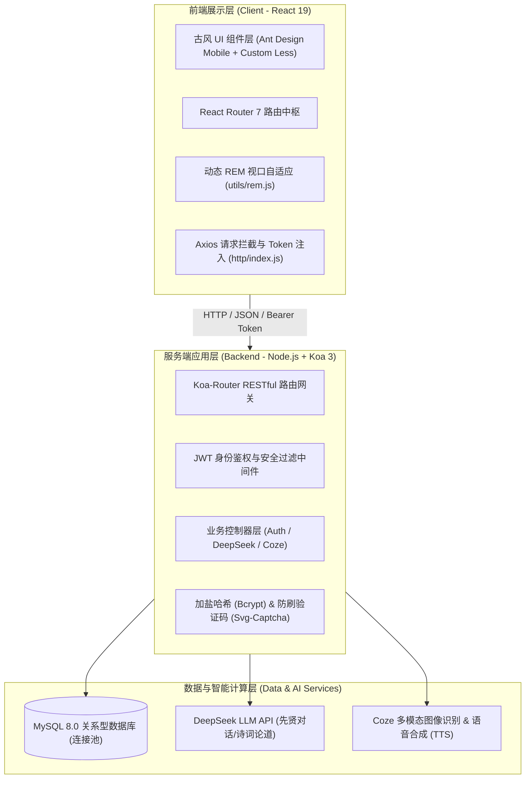
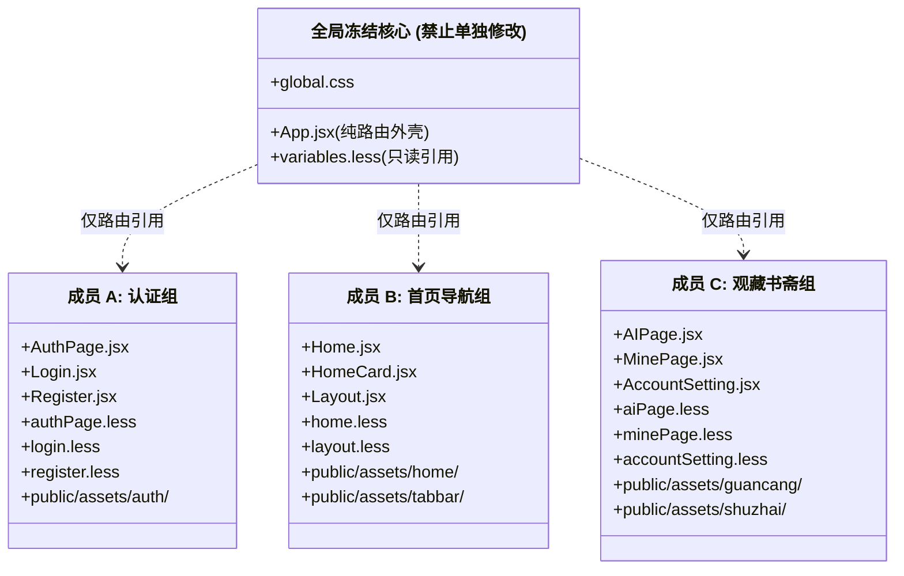

# 📜《云山竹简 · 华风雅集》第一阶段全栈技术需求文档 (TRD)

| 文档版本 | 状态 | 编写人 | 适用范围 | 生效日期 |
| :--- | :--- | :--- | :--- | :--- |
| **v1.0.0** | **已生效 (Approved)** | 技术组长 / 架构师 | 全栈研发团队 (成员 A、B、C) | 2026-10-09 |

---

## 一、 项目背景与技术目标

### 1.1 业务背景
本项目基于原移动端原型工程进行全方位视觉升级与业务转型，由早期的儿童亲子教育应用重构为**面向大众古风爱好者的国风文化修养与 AI 雅聚平台——《云山竹简 · 华风雅集》**。
依据 `D:\图片\simo` 下的 5 套高保真设计稿（入席、缔约、雅集、观藏、墨隐书斋），在第一阶段完成基础骨架、认证体系、核心主视觉及三大主 Tab 页面的完整重构。

### 1.2 核心技术目标
1. **高保真宋代水墨极简美学还原**：建立完整统一的中国传统色谱与古风材质 Token 体系，严格消除科技感发光与儿童向卡通样式。
2. **多终端移动视口自适应**：以 `390px × 844px` 为设计基准，基于动态 `rem` 机制与 Flex/Grid 弹性布局实现全端自适应。
3. **物理级零冲突协同开发架构**：实现 3 人并行协作无交集，确保 Git 提交与分支合并不产生代码冲突。
4. **轻量高性能构建**：Vite 7 + React 19 秒级热更新，首屏渲染控制在 1.5s 以内。

---

## 二、 总体技术架构设计

### 2.1 拓扑分层架构



### 2.2 核心技术栈选型表

| 层次 | 技术选型 | 版本 | 选型考量 |
| :--- | :--- | :--- | :--- |
| **前端框架** | React | 19.x | 函数式组件、Hooks、并发渲染与最新标准支持 |
| **构建工具** | Vite | 7.x | 秒级冷启动、毫秒级 HMR 热更新、Tree-shaking 打包优化 |
| **移动端路由** | React Router | 7.x | 支持嵌套路由 (`Outlet`)、单页状态无缝切换 |
| **UI 组件库** | Ant Design Mobile | 5.x | 轻量成熟、手势支持完善、提供 Toast、ActionSheet 等原生级体验 |
| **样式预处理**| Less | 4.x | 支持变量穿透、嵌套语法、模块化继承 |
| **服务端框架**| Koa | 3.x | 轻量纯粹的洋葱模型中间件、原生 async/await 异步控制 |
| **持久化存储**| MySQL + mysql2/promise | 8.0 | 关系型规范存储、支持 utf8mb4 表情与生僻字、Promise 连接池 |
| **鉴权体系** | jsonwebtoken + bcrypt | 最新 | 无状态 JWT Token 认证，密码加盐哈希持久化 |

---

## 三、 前端设计规范与视口适配方案

### 3.1 视口自适应机制
* **基准视口**：`390px`（以主流移动端为标准设计尺寸）。
* **动态 rem 计算公式**（落地于 `src/utils/rem.js`）：
  $$\text{rootFontSize} = \frac{\text{clientWidth}}{10}\text{ px}$$
  在 `390px` 宽度下，$1\text{ rem} = 39\text{ px}$。开发样式优先采用相对单位或弹性盒，保障小屏 iPhone SE 至大屏 Pro Max 的比例一致。

### 3.2 传统色谱与设计 Tokens (`styles/variables.less`)
所有开发成员必须统一引用预设变量，禁止在局部样式中直接写死硬编码十六进制色值：

| Token 变量名 | 色值代码 | 传统意象名称 | 适用界面元素与场景 |
| :--- | :--- | :--- | :--- |
| `@color-bg` | `#F5F0E6` | **宣纸原色** | 全局页面背景底色，手作生宣微黄质感 |
| `@color-card` | `#FAF7F0` | **绢帛玉白** | 卡片、浮层、表单外框底色 |
| `@color-text-main` | `#22252A` | **远山黛墨** | 正文、主标题、主要文字（松烟浓墨质感） |
| `@color-text-sub` | `#5C6068` | **淡墨焦墨** | 辅助说明、副标题、时间戳、次级文字 |
| `@color-seal` | `#9E2A2B` | **朱砂印泥红** | 印章 Logo、主要操作按钮（CTA）、高亮选中态 |
| `@color-bamboo` | `#3A5A40` | **苍竹墨绿** | 文物鉴宝标签、生机点缀徽标 |
| `@color-indigo` | `#203A4C` | **霁蓝 / 黛青** | 顶部标题、夜间底色、先贤对话气泡 |
| `@color-gold` | `#C59B27` | **沉香古金** | 官品位阶勋章、卷轴金属包边、VIP 雅士标识 |
| `@color-border` | `#E2D9C8` | **古纸线界** | 浅淡纸张折痕边框、竹简细微横竖分隔线 |
| `@radius-card` | `10px` | **方正小圆角** | 8px~12px 规整圆角，杜绝过大圆角带来的卡通感 |

---

## 四、 第一阶段分模块技术需求与实现规约

### 4.1 模块 A：身份认证与安全域【入席 & 缔约】

* **责任人**：成员 A
* **对应视觉稿**：`2299d6017ffad90c7a252c0f296e2db2.png`、`145631cdfb89b1a3f9b189a0a2dc36f5.png`
* **独占文件**：
  * `frontend/src/pages/AuthPage.jsx`
  * `frontend/src/pages/Login.jsx`
  * `frontend/src/pages/Register.jsx`
  * `frontend/src/styles/authPage.less`
  * `frontend/src/styles/login.less`
  * `frontend/src/styles/register.less`
  * 静态资源：`frontend/public/assets/auth/*`

#### 4.1.1 界面与组件设计
1. **外层卡片与头部 (`AuthPage.jsx`)**：
   - 背景采用高质感宣纸底纹与山水水墨透视层；
   - 顶部朱砂印章方印【華風】篆刻 Logo；
   - 标题「云山竹简 · 华风雅集」，副标「读千年风雅 与君共此山河」；
   - 居中滑动印符 Tab：「入席」（登录态）与「缔约」（注册态），带有朱砂红滑块平滑动效。
2. **登录模块 (`Login.jsx`)**：
   - 输入框 1：雅士手机号/信箱，带有账号古典图符；
   - 输入框 2：通行密押（密码），支持小眼睛图标切换明文/密文；
   - 忘记密码跳转入口；
   - 朱砂印泥红主操作按钮「落座入席」；
   - 底部以文会友快捷方式（微信、QQ、Apple 古铜色线框圆标）；
   - 法律合规声明：「入席即代表同意《雅集清规》与《文墨共识》」。
3. **注册模块 (`Register.jsx`)**：
   - 输入框 1：拟定雅号（如青莲散人、东坡词客）；
   - 输入框 2：手机号/信箱；
   - 输入框 3：水墨验真码输入框 + 右侧 `svg-captcha` 验证码图形（点击即时刷新）；
   - 输入框 4：设置通行密押；
   - 主操作按钮「完成缔约」；
   - 注册成功后自动平滑切回「入席」Tab 并自动带入手机号与密码。

#### 4.1.2 客户端表单校验规则
```javascript
// 手机号与主流邮箱正则双重校验
const phoneRegex = /^1[3-9]\d{9}$/;
const emailRegex = /^[a-zA-Z0-9._%+-]+@(?:qq\.com|163\.com|126\.com|sina\.(?:com|cn)|gmail\.com|foxmail\.com)$/i;

// 密码强度校验：6-20位字符
const passwordRegex = /^.{6,20}$/;
```

---

### 4.2 模块 B：主入口与公共导航域【雅集 & 底栏导航】

* **责任人**：成员 B
* **对应视觉稿**：`048335a5a594d0df4d079a8b659c407d.png`
* **独占文件**：
  * `frontend/src/pages/Home.jsx`
  * `frontend/src/styles/home.less`
  * `frontend/src/components/HomeCard.jsx`（或抽离子卡片组件）
  * `frontend/src/pages/Layout.jsx`
  * `frontend/src/styles/layout.less`
  * 静态资源：`frontend/public/assets/home/*`、`frontend/public/assets/tabbar/*`

#### 4.2.1 界面与组件设计
1. **全局底部导航骨架 (`Layout.jsx`)**：
   - 导航三栏结构：
     * `id: 'home'`, `name: '雅集'`, `path: '/home'`, 图标：古典楼阁/雅集
     * `id: 'ai'`, `name: '观藏'`, `path: '/ai'`, 图标：青铜香炉/古鼎
     * `id: 'mine'`, `name: '书斋'`, `path: '/mine'`, 图标：线装书卷/书斋
   - 选中态：图标高亮并带有朱砂红方印下划线指示标。
2. **首页顶部与诗签卷轴 (`Home.jsx`)**：
   - 顶部大标题「云山竹简」，右侧朱砂小红印「华风」，副标题横幅「读千年风雅 与君共此山河」；
   - **【每日诗签】展开式横向卷轴组件**：
     * 左侧朱砂红印挂签「每日诗签」；
     * 居中展示书法名句（例：“山水之乐，在乎山水之间也。”）；
     * 右侧出处落款（“—— 欧阳修《醉翁亭记》”）与闲章戳记。
3. **时令节气与物候信息栏**：
   - 左侧城市气象（杭州 24° 多云 空气优）；
   - 中间农历干支历法（农历 三月廿六 | 乙巳年 庚辰月 丙午日）；
   - 右侧廿四节气卡（清明 | 万物清明 春和景明）。
4. **四大核心雅席入口（2×2 宫格网格）**：
   - **博古识器**（器物鉴赏与瓷器立绘，点击入口「进入 >」）；
   - **先贤论道**（煮茶对坐水墨图，点击入口「进入 >」）；
   - **飞花诗令**（落花诗卷画卷，点击入口「进入 >」）；
   - **四般闲事**（焚香、品茗、插花静物，点击入口「进入 >」）。

---

### 4.3 模块 C：知己观藏与墨隐书斋域【观藏 & 墨隐书斋】

* **责任人**：成员 C
* **对应视觉稿**：`28962a005c3325500d80073a57f7a4ac.png`、`e9cf705149a8608bc469e0ce422f22a3.png`
* **独占文件**：
  * `frontend/src/pages/AIPage.jsx`
  * `frontend/src/styles/aiPage.less`
  * `frontend/src/pages/MinePage.jsx`
  * `frontend/src/styles/minePage.less`
  * `frontend/src/pages/AccountSetting.jsx`
  * `frontend/src/styles/accountSetting.less`
  * 静态资源：`frontend/public/assets/guancang/*`、`frontend/public/assets/shuzhai/*`

#### 4.3.1 界面与组件设计
1. **观藏 · 千古知己模块 (`AIPage.jsx`)**：
   - 顶部题头「古风古友 · 千古知己」，副标「与千古知音对坐，听诗心与风骨」；
   - **先贤画廊横向横滑卡片**：
     * 展示李白、苏轼、王阳明、李清照等先贤古风半身立绘卡；
     * 竖排朱砂红木质名牌（例如【李白】、【苏轼】）。
   - **三大卷轴业务功能卡**：
     * 卷轴 1【古友论道】（副标：与先贤畅谈诗词、人生与智慧 / 标签：诗词赏析、人生问答、风骨启迪）；
     * 卷轴 2【诗韵唱和】（副标：对诗唱和，飞花传令，会古今雅趣 / 标签：飞花诗令、诗句接龙、唱和雅集）；
     * 卷轴 3【抚琴听音】（副标：与古友清谈，于琴音中静听山水 / 标签：语音相伴、古琴清音、沉浸雅境）；
     * 右侧均带有圆形朱砂导向按键。
2. **墨隐书斋 · 个人中心模块 (`MinePage.jsx`)**：
   - 顶部题头「墨隐书斋」，副标「一卷诗书藏风雅 半窗山水养心性」；
   - **雅士身份主卡片**：
     * 圆形山水竹影水墨头像框；
     * 居中展示雅号「云山居士」与铜制勋标「翰林待诏」；
     * 个性签名「读千年风雅 与君共此山河」；
   - **四列修持数据仪表盘**：
     * `12` 鉴宝藏器 ｜ `36` 论道问策 ｜ `48` 诗签摘录 ｜ `玖阶` 文风品阶；
   - **双折叠列表卡片**：
     * 列表卡 1【藏品与墨卷】：我的藏品、我的诗笺、我的墨卷、我的雅集；
     * 列表卡 2【书斋清规】：账号设置（跳转 `/accountSetting`）、隐私与安全、消息通知、帮助与反馈。

---

## 五、 接口契约与数据结构规范

### 5.1 核心 RESTful API 规格表

| 接口路径 | 请求方法 | 鉴权要求 | 说明 | 请求体 / Query | 返回核心载荷 (JSON) |
| :--- | :--- | :--- | :--- | :--- | :--- |
| `/api/auth/captcha` | `GET` | 无 | 获取防刷图形验证码 | 无 | `{ captchaId: string, captchaSvg: string }` |
| `/api/auth/register` | `POST` | 无 | 雅士注册立约 | `{ nickname, phone, password, captchaCode, captchaId }` | `{ code: 200, message: "注册成功" }` |
| `/api/auth/login` | `POST` | 无 | 雅士落座入席 | `{ phone, password }` | `{ code: 200, token: string, user: {...} }` |
| `/api/auth/info` | `GET` | Bearer JWT | 获取雅士个人资料与修持数据 | Header: `Authorization: Bearer <token>` | `{ id, phone, nickname, avatar, rank: "玖阶", stats: {...} }` |

### 5.2 数据库核心表结构定义 (`users` 表)

```sql
CREATE TABLE IF NOT EXISTS `users` (
  `id` INT AUTO_INCREMENT PRIMARY KEY COMMENT '雅士自增主键ID',
  `phone` VARCHAR(30) NOT NULL UNIQUE COMMENT '手机号或信箱账号（唯一索引）',
  `password_hash` VARCHAR(255) NOT NULL COMMENT 'Bcrypt加密存储密码哈希',
  `nickname` VARCHAR(50) DEFAULT '云山居士' COMMENT '雅号/修身昵称',
  `title` VARCHAR(50) DEFAULT '翰林待诏' COMMENT '文风品位称号',
  `avatar` LONGTEXT DEFAULT NULL COMMENT '水墨头像Base64或URL',
  `appraise_count` INT DEFAULT 0 COMMENT '鉴宝藏器数',
  `debate_count` INT DEFAULT 0 COMMENT '论道问策数',
  `poem_count` INT DEFAULT 0 COMMENT '诗签摘录数',
  `rank_level` VARCHAR(20) DEFAULT '玖阶' COMMENT '文风品阶',
  `created_at` TIMESTAMP DEFAULT CURRENT_TIMESTAMP COMMENT '立约注册时间'
) ENGINE=InnoDB DEFAULT CHARSET=utf8mb4 COLLATE=utf8mb4_unicode_ci;
```

---

## 六、 研发协同与防冲突工程机制

### 6.1 物理文件所有权隔离矩阵



### 6.2 协同防冲突三大军规
1. **军规一：严禁修改非自身白名单文件**。特别是 [App.jsx](file:///d:/SinoWind/sino-wind/frontend/src/App.jsx)、[global.css](file:///d:/SinoWind/sino-wind/frontend/src/styles/global.css) 和 [variables.less](file:///d:/SinoWind/sino-wind/frontend/src/styles/variables.less)。
2. **军规二：静态资源命名空间隔离**。所有切图严禁放在 `public/` 根目录下，必须存放在对应模块子目录中。
3. **军规三：样式隔离规约**。每个页面的 `.less` 文件必须最外层由独占类名包裹（如 `.auth-page-root`、`.home-root`、`.guancang-root`、`.mine-page-root`），杜绝类名污染。

---

## 七、 非功能性需求与性能指标 (NFR)

1. **渲染性能指标**：
   - 首次内容绘制（FCP）：$\le 1.0\text{ s}$；
   - 最大内容绘制（LCP）：$\le 1.8\text{ s}$；
   - 页面切换交互延迟（FID / INP）：$\le 100\text{ ms}$。
2. **切图与静态素材体积控制**：
   - 卷轴长背景图、宣纸背景图须经过无损压缩，单图大小建议控制在 $200\text{ KB}$ 以内；
   - 图标优先使用矢量化或已有的字体图标库（`iconfont`）。
3. **移动端适配与防穿透**：
   - 移动端滚动禁用横向越界溢出（`overflow-x: hidden`）；
   - 底部 Tabbar 与 iOS 底部黑条做好安全区适配（`padding-bottom: env(safe-area-inset-bottom)`）。

---

## 八、 里程碑与排期计划

| 阶段 | 周期 | 核心交付物 | 责任人 | 验收标志 |
| :--- | :--- | :--- | :--- | :--- |
| **M0: 基建准备** | Day 0 | 抽离 AuthPage、建立 variables.less、新建静态目录 | 组长 | `npm run build` 0 报错并提交主分支 |
| **M1: 并行开发** | Day 1 ~ Day 2 | 3 组独立分支完成 5 大页面 UI 高保真还原及交互 | 成员 A、B、C | 各自分支本地调试无阻碍 |
| **M2: PR 合并** | Day 3 上午 | 3 支独立分支合入 `main` | 组长审核 | 0 Git Conflict，自动化构建通过 |
| **M3: 全局联调** | Day 3 下午 | 路由跳转、Token 认证、响应式全机型走查 | 全体成员 | 移动端真机全流程走通 |
